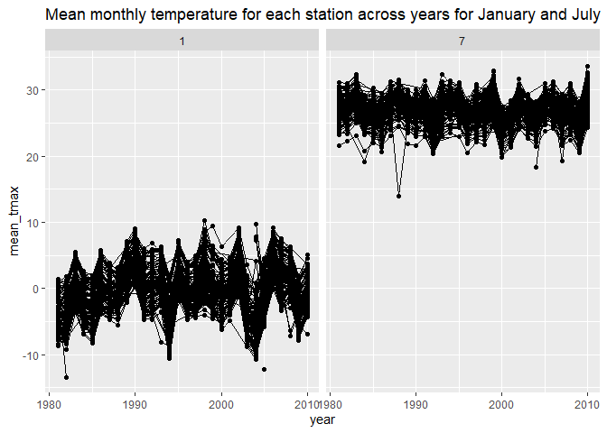
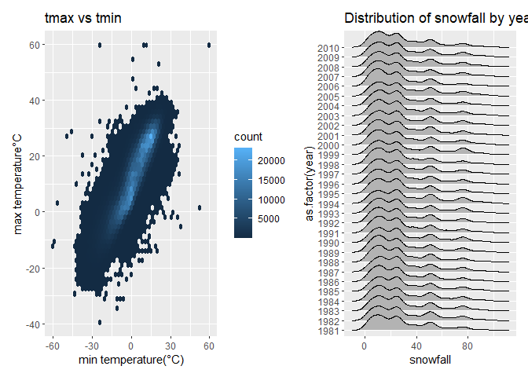
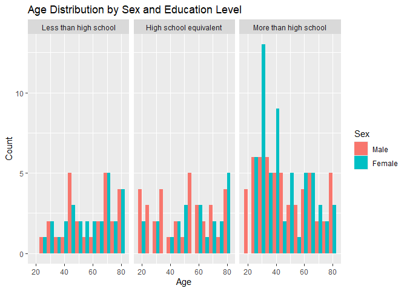
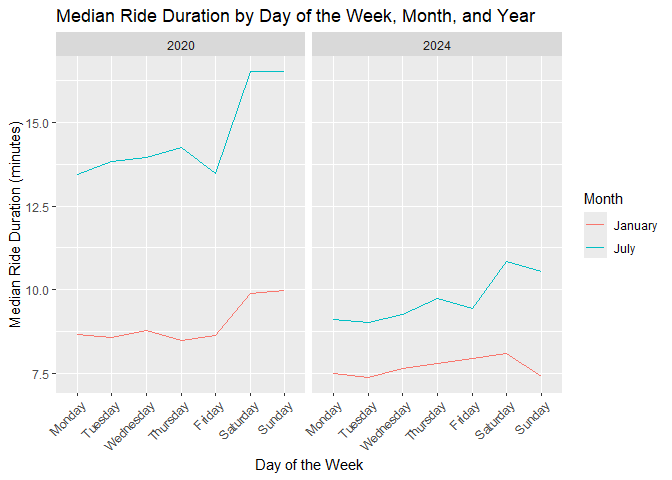
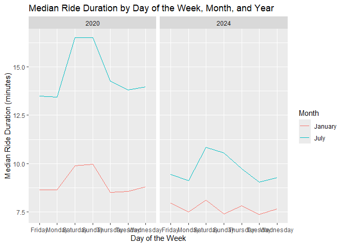

p8105_hw3_jw4690
================
Jingxi Wang
2024-10-10

## Problem 1

``` r
library(p8105.datasets)
data("ny_noaa")
```

``` r
ny_noaa_df = ny_noaa |>
  filter(!is.na(date),
         !is.na(tmax),
         !is.na(tmin)) |>
  mutate(year = year(date),
         month = month(date),
         day = day(date)) |>
  mutate(tmin = as.numeric(tmin) / 10,
         tmax = as.numeric(tmax) / 10,
         prcp = as.numeric(prcp) / 10)
```

This dataset has 7 variables and 2595176 observations. The key variables
include date, sonwfall, prcp, max temperature, and min temperature.

``` r
# find the most commonly observed values for snowfall

snowfall_counts = ny_noaa_df |>
  filter(!is.na(snow)) |>
  count(snow) |>
  arrange(desc(n))

snowfall_counts
```

    ## # A tibble: 251 × 2
    ##     snow       n
    ##    <int>   <int>
    ##  1     0 1167149
    ##  2    25   17542
    ##  3    13   13704
    ##  4    51   10352
    ##  5     5    5960
    ##  6    76    5894
    ##  7     8    5777
    ##  8     3    5614
    ##  9    38    5578
    ## 10   102    3743
    ## # ℹ 241 more rows

The most commonly observed values for snowfall is 0 mm. I think it’s
because snowfall only occurs during certain month, while for much of the
year, no snow is recorded. 25mm, 13mm, 51mm are also common values.

``` r
# Make a two-panel plot showing the average max temperature in January and in July in each station across years.

ny_noaa_df |>
  group_by(id, year, month) |>
  filter(month %in% c(1, 7)) |>
  summarize(mean_tmax = mean(tmax, na.rm = TRUE, color = id)) |>
  ggplot(aes(x = year, y = mean_tmax, group = id)) +
  geom_point() + geom_path() +
  facet_grid(~month) +
  labs(title = "Mean monthly temperature for each station across years for January and July")
```

    ## `summarise()` has grouped output by 'id', 'year'. You can override using the
    ## `.groups` argument.

<!-- -->

In January, temperatures are typically lower, reflecting the winter
season. The temperature distribution tends to be centered around 0°C. In
July, temperatures tend to be higher due to the summer season. There are
some instances of extremely low temperatures in July, which are
considered outliers.

``` r
#Make a two-panel plot showing (i) tmax vs tmin; and (ii) make a plot showing the distribution of snowfall values greater than 0 and less than 100 separately by year.

tmax_tmin = ny_noaa_df |>
  ggplot(aes(x = tmin, y = tmax)) +
  geom_hex(bins = 50) +
  labs(title = "tmax vs tmin", x = "min temperature(°C)", y = "max temperature°C")
```

``` r
snowfall_df = ny_noaa_df |>
  filter(snow > 0 & snow < 100)

snowfall_plot = snowfall_df |>
  ggplot(aes(x = snow, y = as.factor(year))) +
  geom_density_ridges() +
  labs(title = "Distribution of snowfall by year", x = "snowfall")
```

``` r
tmax_tmin + snowfall_plot
```

    ## Picking joint bandwidth of 4.16

<!-- -->

The first panel uses a hexbin plot to represent the relationship between
tmax and tmin, which helps visualize the density of temperature
observations. The second panel shows the distribution of snowfall
(between 0 and 100 mm) separately for each year, highlighting seasonal
patterns or anomalies in snowfall over time.

## Problem 2

``` r
# Load, tidy, merge, and otherwise organize the data sets

accel_df = read_csv("./data/nhanes_accel.csv")
```

    ## Rows: 250 Columns: 1441
    ## ── Column specification ────────────────────────────────────────────────────────
    ## Delimiter: ","
    ## dbl (1441): SEQN, min1, min2, min3, min4, min5, min6, min7, min8, min9, min1...
    ## 
    ## ℹ Use `spec()` to retrieve the full column specification for this data.
    ## ℹ Specify the column types or set `show_col_types = FALSE` to quiet this message.

``` r
covar_df = read_csv("./data/nhanes_covar.csv", skip = 4)
```

    ## Rows: 250 Columns: 5
    ## ── Column specification ────────────────────────────────────────────────────────
    ## Delimiter: ","
    ## dbl (5): SEQN, sex, age, BMI, education
    ## 
    ## ℹ Use `spec()` to retrieve the full column specification for this data.
    ## ℹ Specify the column types or set `show_col_types = FALSE` to quiet this message.

``` r
covar_df = covar_df |>
  mutate(
    SEQN = as.integer(SEQN),
    sex = factor(sex, levels = c(1, 2), labels = c("Male", "Female")),
    age = as.integer(age),
    BMI = as.numeric(BMI),
    education = factor(education, levels = c(1, 2, 3), 
                       labels = c("Less than high school", "High school equivalent", 
                                  "More than high school"))
  ) |>
  filter(age >= 21)

merged_df = inner_join(accel_df, covar_df, by = "SEQN") |>
  drop_na(sex, age, BMI, education)
```

``` r
# reader-friendly table for the number of men and women in each education category

education_sex_table = merged_df |>
   group_by(education, sex) |>
  summarize(count = n()) |>
  pivot_wider(names_from = sex,
              values_from = count) |>
  rename("Education Category" = education)
```

    ## `summarise()` has grouped output by 'education'. You can override using the
    ## `.groups` argument.

``` r
education_sex_table |> 
  knitr::kable(caption = "Sex and Education Category")
```

| Education Category     | Male | Female |
|:-----------------------|-----:|-------:|
| Less than high school  |   27 |     28 |
| High school equivalent |   35 |     23 |
| More than high school  |   56 |     59 |

Sex and Education Category

``` r
# visualization of the age distributions for men and women in each education category

education_sex_plot = ggplot(merged_df, aes(x = age, fill = sex)) +
  geom_histogram(binwidth = 5, position = "dodge") +
  facet_wrap(. ~ education) +
  labs(title = "Age Distribution by Sex and Education Level",
       x = "Age",
       y = "Count",
       fill = "Sex")

education_sex_plot
```

<!-- -->

The table shows the number of men and women in each education category,
making it easy to compare gender distribution across different
educational levels. We can observe that the number of men and women in
each category are pretty similar.

The plot visualizes the age distribution for men and women within each
education category. It can show how age ranges might differ between
genders in the same education level, or how education is distributed
across age groups. For those with “Less than high school,” the age
distribution appears fairly evenly spread across different age groups,
with no clear peak for either males or females. In the “High school
equivalent” group, the age distribution is somewhat more scattered, but
still fairly balanced between the sexes, without a clear age range
standing out. The “More than high school” group shows a larger count of
people in the 30-50 age range, especially among males.

``` r
# plot  total activity over the day

merged_df$total_activity <- rowSums(merged_df[, 2:1441])

total_activity_plot = merged_df |>
  ggplot(aes(x = age, y = total_activity, color = sex)) +
  geom_point(alpha = .5) +
  geom_smooth(se = FALSE) +
  facet_wrap(. ~ education) +
  labs(title = "Total Activity vs Age by Sex and Education Level",
       x = "Age",
       y = "Total Activity",
       color = "Sex")

total_activity_plot
```

    ## `geom_smooth()` using method = 'loess' and formula = 'y ~ x'

<!-- -->

In the “Less than high school” group, activity drops significantly after
age 60 for both sexes. The “High school equivalent” group shows more
fluctuation, with activity peaking around ages 40–50 and declining
afterward, while females maintain slightly higher activity in older
ages. In the “More than high school” group, both sexes show more stable
activity levels, with females maintaining steady activity longer than
males. Higher education seems to be linked with a more gradual decline
in activity, especially for women.

``` r
# Make a three-panel plot that shows the 24-hour activity time courses for each education level 

minute_cols = merged_df |>
  select(starts_with("min"))

Accelerometer_df = merged_df |>
  select(SEQN, sex, education, everything()) |>
  pivot_longer(cols = starts_with("min"), names_to = "minute", values_to = "activity") |>
  mutate(minute = as.numeric(sub("min", "", minute)))

Accelerometer_plot = Accelerometer_df |>
  ggplot(aes(x = minute, y = activity, color = sex)) +
  geom_line(aes(group = SEQN), alpha = 0.3) +
  geom_smooth(se = FALSE) +
  facet_wrap(. ~ education) +
  labs(title = "24-Hour Activity Time Course by Education Level",
       x = "Minute of the Day",
       y = "Activity",
       color = "Sex") +
  theme(axis.text.x = element_text(angle = 45, hjust = 1))

Accelerometer_plot
```

    ## `geom_smooth()` using method = 'gam' and formula = 'y ~ s(x, bs = "cs")'

<!-- -->

This chart shows daily activity patterns over a 24-hour period for males
and females across three education levels. In all categories, activity
rises sharply in the morning, peaks, and then gradually declines
throughout the day, with smaller activity spikes toward the evening. The
activity trends for both males and females are similar, though females
tend to have slightly more consistent activity levels across the day.
There are no significant differences between education levels, though
the “More than high school” group shows slightly higher peaks of
activity during the day.

## Problem 3

``` r
# Import, clean, and tidy these data

Jan_2020 = read_csv("./data/citibike/Jan 2020 Citi.csv/Jan 2020 Citi.csv") |>
  mutate(year = 2020, month = "January")
```

    ## Rows: 12420 Columns: 7
    ## ── Column specification ────────────────────────────────────────────────────────
    ## Delimiter: ","
    ## chr (6): ride_id, rideable_type, weekdays, start_station_name, end_station_n...
    ## dbl (1): duration
    ## 
    ## ℹ Use `spec()` to retrieve the full column specification for this data.
    ## ℹ Specify the column types or set `show_col_types = FALSE` to quiet this message.

``` r
Jan_2024 = read_csv("./data/citibike/Jan 2024 Citi.csv/Jan 2024 Citi.csv") |>
  mutate(year = 2024, month = "January")
```

    ## Rows: 18861 Columns: 7
    ## ── Column specification ────────────────────────────────────────────────────────
    ## Delimiter: ","
    ## chr (6): ride_id, rideable_type, weekdays, start_station_name, end_station_n...
    ## dbl (1): duration
    ## 
    ## ℹ Use `spec()` to retrieve the full column specification for this data.
    ## ℹ Specify the column types or set `show_col_types = FALSE` to quiet this message.

``` r
July_2020 = read_csv("./data/citibike/July 2020 Citi.csv/July 2020 Citi.csv") |>
  mutate(year = 2020, month = "July")
```

    ## Rows: 21048 Columns: 7
    ## ── Column specification ────────────────────────────────────────────────────────
    ## Delimiter: ","
    ## chr (6): ride_id, rideable_type, weekdays, start_station_name, end_station_n...
    ## dbl (1): duration
    ## 
    ## ℹ Use `spec()` to retrieve the full column specification for this data.
    ## ℹ Specify the column types or set `show_col_types = FALSE` to quiet this message.

``` r
July_2024 = read_csv("./data/citibike/July 2024 Citi.csv/July 2024 Citi.csv") |>
  mutate(year = 2024, month = "July")
```

    ## Rows: 47156 Columns: 7
    ## ── Column specification ────────────────────────────────────────────────────────
    ## Delimiter: ","
    ## chr (6): ride_id, rideable_type, weekdays, start_station_name, end_station_n...
    ## dbl (1): duration
    ## 
    ## ℹ Use `spec()` to retrieve the full column specification for this data.
    ## ℹ Specify the column types or set `show_col_types = FALSE` to quiet this message.

``` r
combined_df= bind_rows(Jan_2020, Jan_2024, July_2020, July_2024)
```

The final dataset combines information from January 2020, January 2024,
July 2020, and July 2024. Each record represents a ride in the Citi Bike
system, capturing details such as ride duration, the type of bike used,
the stations involved, and the user’s membership status.

``` r
summary_table = combined_df |>
  group_by(year, month, member_casual) |>
  summarize(total_rides = n()) |>
  arrange(year, month) |>
  pivot_wider(names_from = member_casual,
              values_from = total_rides) |>
  rename("Causal Riders" = casual,
         "Member Riders" = member)
```

    ## `summarise()` has grouped output by 'year', 'month'. You can override using the
    ## `.groups` argument.

``` r
summary_table |>
  knitr::kable(caption = "Total Number of Rides")
```

| year | month   | Causal Riders | Member Riders |
|-----:|:--------|--------------:|--------------:|
| 2020 | January |           984 |         11436 |
| 2020 | July    |          5637 |         15411 |
| 2024 | January |          2108 |         16753 |
| 2024 | July    |         10894 |         36262 |

Total Number of Rides

The number of Casual Riders has increased over time, particularly in
July 2024, with a sharp rise from previous years. The number of Member
Riders also shows growth, especially in July, where the figures have
more than doubled from 2020 to 2024. There seems to be a seasonal
pattern, where both rider types tend to increase significantly in July
compared to January.

``` r
# Make a table showing the 5 most popular starting stations for July 2024

top_starting_stations = July_2024 |>
  group_by(start_station_name) |>
  summarise(total_rides = n()) |>
  arrange(desc(total_rides)) |>
  slice(1:5)

top_starting_stations |>
  knitr::kable(caption = "The 5 Most Popular Starting Stations for July 2024")
```

| start_station_name       | total_rides |
|:-------------------------|------------:|
| Pier 61 at Chelsea Piers |         163 |
| University Pl & E 14 St  |         155 |
| W 21 St & 6 Ave          |         152 |
| West St & Chambers St    |         150 |
| W 31 St & 7 Ave          |         146 |

The 5 Most Popular Starting Stations for July 2024

The 5 most popular starting stations in July 2024 are: Pier 61 at
Chelsea Piers, University Pl & E 14 St, W 21 St & 6 Ave, West St &
Chambers St, and W 31 St & 7 Ave.

``` r
# Make a plot to investigate the effects of day of the week, month, and year on median ride duration

median_duration_df = combined_df |>
  group_by(year, month, weekdays) |>
  summarize(median_duration = median(duration, na.rm = TRUE)) |>
  mutate(weekdays = factor(weekdays, levels = c("Monday", "Tuesday", "Wednesday", "Thursday", "Friday", "Saturday", "Sunday")))
```

    ## `summarise()` has grouped output by 'year', 'month'. You can override using the
    ## `.groups` argument.

``` r
median_duration_plot = median_duration_df |>
  ggplot(aes(x = weekdays, y = median_duration, color = month)) +
  geom_line(aes(group = interaction(year, month))) +
  facet_wrap(. ~ year) + 
  labs(title = "Median Ride Duration by Day of the Week, Month, and Year",
       x = "Day of the Week",
       y = "Median Ride Duration (minutes)",
       color = "Month") +
  theme(axis.text.x = element_text(angle = 45, hjust = 1))

median_duration_plot
```

<!-- -->

This plot shows that July has consistently longer median ride durations
compared to January in both 2020 and 2024, indicating a seasonal effect.
In July, rides peak on Saturdays, especially in 2020, while January has
more stable and shorter ride durations throughout the week. Overall,
summer months (July) see more variability and longer rides, particularly
on weekends, whereas winter months (January) show little variation in
ride duration across the week.

``` r
#  make a figure that shows the impact of month, membership status, and bike type on the distribution of ride duration

df_2024 = combined_df |>
  filter(year == 2024)

figure_2024 = df_2024 |> 
  ggplot(aes(x = month, y = duration, fill = rideable_type)) +
  geom_boxplot() + 
  facet_wrap(. ~ member_casual) +
  labs(title = "Impact of Month, Membership Status, and Bike Type on Ride Duration in 2024", 
       x = "Month", 
       y = "Ride Duration (minutes)", 
       fill = "Membership Status")

figure_2024
```

<!-- -->

This plot shows that casual riders tend to have longer ride durations
compared to members, especially in July. Casual riders using classic
bikes have the longest ride durations, particularly in July, with a
higher spread of values. In contrast, members have more consistent,
shorter ride durations regardless of bike type or month. Electric bikes
generally result in shorter rides for both groups. This suggests that
casual riders, especially in summer, prefer longer rides, while members
maintain shorter and more consistent ride durations throughout the year.
