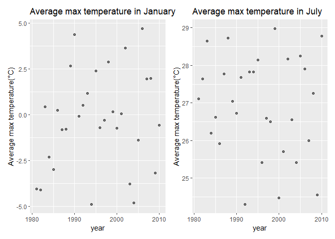
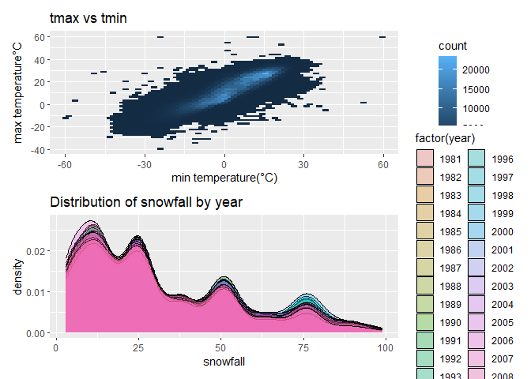
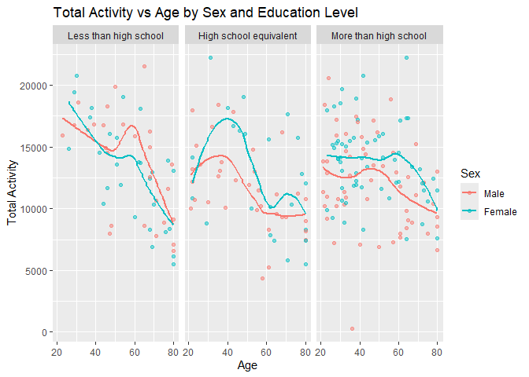
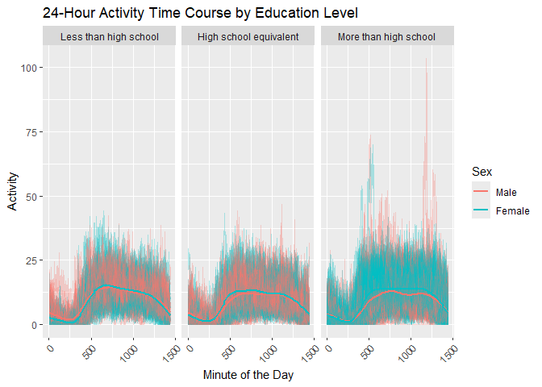
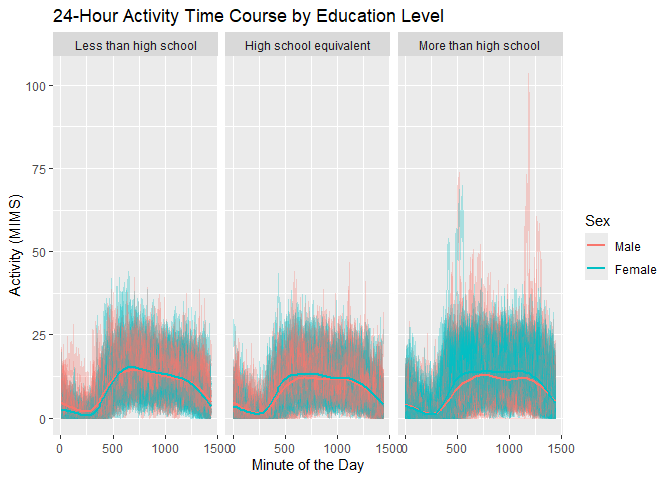

p8105_hw3_jw4690
================
Jingxi Wang
2024-10-10

## Problem 1

``` r
library(p8105.datasets)
data("ny_noaa")
```

``` r
ny_noaa_df = ny_noaa |>
  filter(!is.na(date),
         !is.na(tmax),
         !is.na(tmin)) |>
  mutate(year = year(date),
         month = month(date),
         day = day(date)) |>
  mutate(tmin = as.numeric(tmin) / 10,
         tmax = as.numeric(tmax) / 10)
```

This dataset has 7 variables and 2595176 observations. The key variables
include date, sonwfall, prcp, max temperature, and min temperature.

``` r
# find the most commonly observed values for snowfall

snowfall_counts = ny_noaa_df |>
  count(snow, name = "n_obs")

common_snowfall = snowfall_counts |>
  filter(n_obs == max(n_obs))
```

The most commonly observed values for snowfall is 0. I think it’s
because snowfall only occurs during certain month, while for much of the
year, no snow is recorded, and even during winter month, many days may
still have no snowfall.

``` r
avg_max_Jan = ny_noaa_df|>
  group_by(year) |>
  filter(month == 1) |>
  summarize(
    mean_tmax = mean(tmax, na.rm = TRUE))

Jan_plot = avg_max_Jan |>
  ggplot(aes(x = year, y = mean_tmax)) +
  geom_point(alpha = .5) +
  labs(title = "Average max temperature in January", y = "Average max temperature(°C)")
  theme(legend.position = "none")
```

    ## List of 1
    ##  $ legend.position: chr "none"
    ##  - attr(*, "class")= chr [1:2] "theme" "gg"
    ##  - attr(*, "complete")= logi FALSE
    ##  - attr(*, "validate")= logi TRUE

``` r
avg_max_July = ny_noaa_df|>
  group_by(year) |>
  filter(month == 7) |>
  summarize(
    mean_tmax = mean(tmax, na.rm = TRUE))

July_plot = avg_max_July |>
  ggplot(aes(x = year, y = mean_tmax)) +
  geom_point(alpha = .5) +
  labs(title = "Average max temperature in July", y = "Average max temperature(°C)")
  theme(legend.position = "none")
```

    ## List of 1
    ##  $ legend.position: chr "none"
    ##  - attr(*, "class")= chr [1:2] "theme" "gg"
    ##  - attr(*, "complete")= logi FALSE
    ##  - attr(*, "validate")= logi TRUE

``` r
Jan_plot + July_plot
```

<!-- -->

In January, temperatures are typically lower, reflecting the winter
season. The temperature distribution tends to be centered around 0°C. In
July, temperatures tend to be higher due to the summer season. There are
some instances of extremely low temperatures in July, which are
considered outliers.

``` r
tmax_tmin = ny_noaa_df |>
  ggplot(aes(x = tmin, y = tmax)) +
  geom_hex(bins = 50) +
  labs(title = "tmax vs tmin", x = "min temperature(°C)", y = "max temperature°C")
```

``` r
snowfall_df = ny_noaa_df |>
  filter(snow > 0 & snow < 100)

snowfall_plot = snowfall_df |>
  ggplot(aes(x = snow, fill = factor(year))) +
  geom_density(alpha = .3) +
  labs(title = "Distribution of snowfall by year", x = "snowfall")
```

``` r
tmax_tmin / snowfall_plot
```

<!-- -->

The first panel uses a hexbin plot to represent the relationship between
tmax and tmin, which helps visualize the density of temperature
observations. The second panel shows the distribution of snowfall
(between 0 and 100 mm) separately for each year, highlighting seasonal
patterns or anomalies in snowfall over time.

## Problem 2

``` r
accel_df = read_csv("./data/nhanes_accel.csv")
```

    ## Rows: 250 Columns: 1441
    ## ── Column specification ────────────────────────────────────────────────────────
    ## Delimiter: ","
    ## dbl (1441): SEQN, min1, min2, min3, min4, min5, min6, min7, min8, min9, min1...
    ## 
    ## ℹ Use `spec()` to retrieve the full column specification for this data.
    ## ℹ Specify the column types or set `show_col_types = FALSE` to quiet this message.

``` r
covar_df = read_csv("./data/nhanes_covar.csv", skip = 4)
```

    ## Rows: 250 Columns: 5
    ## ── Column specification ────────────────────────────────────────────────────────
    ## Delimiter: ","
    ## dbl (5): SEQN, sex, age, BMI, education
    ## 
    ## ℹ Use `spec()` to retrieve the full column specification for this data.
    ## ℹ Specify the column types or set `show_col_types = FALSE` to quiet this message.

``` r
covar_df = covar_df |>
  mutate(
    SEQN = as.integer(SEQN),
    sex = factor(sex, levels = c(1, 2), labels = c("Male", "Female")),
    age = as.integer(age),
    BMI = as.numeric(BMI),
    education = factor(education, levels = c(1, 2, 3), 
                       labels = c("Less than high school", "High school equivalent", 
                                  "More than high school"))
  ) |>
  filter(age >= 21)

merged_df = inner_join(accel_df, covar_df, by = "SEQN") |>
  drop_na(sex, age, BMI, education)
```

``` r
education_sex_table = merged_df |>
   group_by(education, sex) |>
  summarize(count = n(), .groups = "drop") |>
  arrange(education)

education_sex_plot = ggplot(merged_df, aes(x = age, fill = sex)) +
  geom_histogram(binwidth = 5, position = "dodge") +
  facet_wrap(. ~ education) +
  labs(title = "Age Distribution by Sex and Education Level",
       x = "Age",
       y = "Count",
       fill = "Sex")

education_sex_plot
```

<!-- -->

The table shows the number of men and women in each education category,
making it easy to compare gender distribution across different
educational levels.

The plot visualizes the age distribution for men and women within each
education category. It can show how age ranges might differ between
genders in the same education level, or how education is distributed
across age groups.

``` r
merged_df$total_activity <- rowSums(merged_df[, 2:1441])

total_activity_plot = merged_df |>
  ggplot(aes(x = age, y = total_activity, color = sex)) +
  geom_point(alpha = .5) +
  geom_smooth(se = FALSE) +
  facet_wrap(. ~ education) +
  labs(title = "Total Activity vs Age by Sex and Education Level",
       x = "Age",
       y = "Total Activity",
       color = "Sex")

total_activity_plot
```

    ## `geom_smooth()` using method = 'loess' and formula = 'y ~ x'

<!-- -->

This plot shows how total physical activity varies by age for both men
and women, with separate panels for each education level. The trend
lines help illustrate potential differences between genders across
different age groups and education levels. The smooth lines highlight
these trends, making it easier to compare overall patterns. We can
observe that the activity levels decrease with age, and there could be
noticeable differences in activity between men and women, as well as
between educational groups.

``` r
minute_cols = merged_df |>
  select(starts_with("min"))

Accelerometer_df = merged_df |>
  select(SEQN, sex, education, everything()) |>
  pivot_longer(cols = starts_with("min"), names_to = "minute", values_to = "activity") |>
  mutate(minute = as.numeric(sub("min", "", minute)))

Accelerometer_plot = Accelerometer_df |>
  ggplot(aes(x = minute, y = activity, color = sex)) +
  geom_line(aes(group = SEQN), alpha = 0.3) +
  geom_smooth(se = FALSE) +
  facet_wrap(. ~ education) +
  labs(title = "24-Hour Activity Time Course by Education Level",
       x = "Minute of the Day",
       y = "Activity (MIMS)",
       color = "Sex")

Accelerometer_plot
```

    ## `geom_smooth()` using method = 'gam' and formula = 'y ~ s(x, bs = "cs")'

<!-- -->

The plot shows how activity levels fluctuate over the course of the day,
broken down by education level, and will use different colors to
represent the sex of the participants. Across all education levels,
activity tends to increase during daylight hours, with notable peaks
during the morning and afternoon, followed by a decline during the
night.
