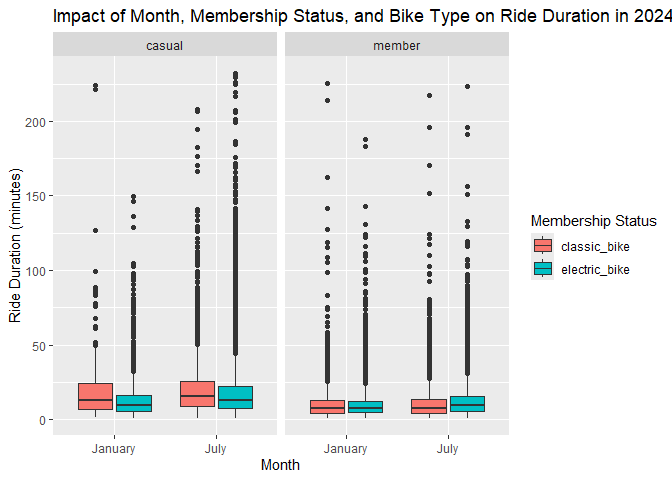

p8105_hw3_jw4690
================
Jingxi Wang
2024-10-10

## Problem 1

``` r
library(p8105.datasets)
data("ny_noaa")
```

``` r
ny_noaa_df = ny_noaa |>
  filter(!is.na(date),
         !is.na(tmax),
         !is.na(tmin)) |>
  mutate(year = year(date),
         month = month(date),
         day = day(date)) |>
  mutate(tmin = as.numeric(tmin) / 10,
         tmax = as.numeric(tmax) / 10,
         prcp = as.numeric(prcp) / 10)
```

This dataset has 7 variables and 2595176 observations. The key variables
include date, sonwfall, prcp, max temperature, and min temperature.

``` r
# find the most commonly observed values for snowfall

snowfall_counts = ny_noaa_df |>
  filter(!is.na(snow)) |>
  count(snow) |>
  arrange(desc(n))

snowfall_counts
```

    ## # A tibble: 251 × 2
    ##     snow       n
    ##    <int>   <int>
    ##  1     0 1167149
    ##  2    25   17542
    ##  3    13   13704
    ##  4    51   10352
    ##  5     5    5960
    ##  6    76    5894
    ##  7     8    5777
    ##  8     3    5614
    ##  9    38    5578
    ## 10   102    3743
    ## # ℹ 241 more rows

The most commonly observed values for snowfall is 0 mm. I think it’s
because snowfall only occurs during certain month, while for much of the
year, no snow is recorded. 25mm, 13mm, 51mm are also common values.

``` r
# Make a two-panel plot showing the average max temperature in January and in July in each station across years.

ny_noaa_df |>
  group_by(id, year, month) |>
  filter(month %in% c(1, 7)) |>
  summarize(mean_tmax = mean(tmax, na.rm = TRUE, color = id)) |>
  ggplot(aes(x = year, y = mean_tmax, group = id)) +
  geom_point() + geom_path() +
  facet_grid(~month) +
  labs(title = "Mean monthly temperature for each station across years for January and July")
```

    ## `summarise()` has grouped output by 'id', 'year'. You can override using the
    ## `.groups` argument.

<!-- -->

In January, temperatures are typically lower, reflecting the winter
season. The temperature distribution tends to be centered around 0°C. In
July, temperatures tend to be higher due to the summer season. There are
some instances of extremely low temperatures in July, which are
considered outliers.

``` r
#Make a two-panel plot showing (i) tmax vs tmin; and (ii) make a plot showing the distribution of snowfall values greater than 0 and less than 100 separately by year.

tmax_tmin = ny_noaa_df |>
  ggplot(aes(x = tmin, y = tmax)) +
  geom_hex(bins = 50) +
  labs(title = "tmax vs tmin", x = "min temperature(°C)", y = "max temperature°C")
```

``` r
snowfall_df = ny_noaa_df |>
  filter(snow > 0 & snow < 100)

snowfall_plot = snowfall_df |>
  ggplot(aes(x = snow, y = as.factor(year))) +
  geom_density_ridges() +
  labs(title = "Distribution of snowfall by year", x = "snowfall")
```

``` r
tmax_tmin + snowfall_plot
```

    ## Picking joint bandwidth of 4.16

<!-- -->

The first panel uses a hexbin plot to represent the relationship between
tmax and tmin, which helps visualize the density of temperature
observations. The second panel shows the distribution of snowfall
(between 0 and 100 mm) separately for each year, highlighting seasonal
patterns or anomalies in snowfall over time.

## Problem 2

``` r
# Load, tidy, merge, and otherwise organize the data sets

accel_df = read_csv("./data/nhanes_accel.csv")
```

    ## Rows: 250 Columns: 1441
    ## ── Column specification ────────────────────────────────────────────────────────
    ## Delimiter: ","
    ## dbl (1441): SEQN, min1, min2, min3, min4, min5, min6, min7, min8, min9, min1...
    ## 
    ## ℹ Use `spec()` to retrieve the full column specification for this data.
    ## ℹ Specify the column types or set `show_col_types = FALSE` to quiet this message.

``` r
covar_df = read_csv("./data/nhanes_covar.csv", skip = 4)
```

    ## Rows: 250 Columns: 5
    ## ── Column specification ────────────────────────────────────────────────────────
    ## Delimiter: ","
    ## dbl (5): SEQN, sex, age, BMI, education
    ## 
    ## ℹ Use `spec()` to retrieve the full column specification for this data.
    ## ℹ Specify the column types or set `show_col_types = FALSE` to quiet this message.

``` r
covar_df = covar_df |>
  mutate(
    SEQN = as.integer(SEQN),
    sex = factor(sex, levels = c(1, 2), labels = c("Male", "Female")),
    age = as.integer(age),
    BMI = as.numeric(BMI),
    education = factor(education, levels = c(1, 2, 3), 
                       labels = c("Less than high school", "High school equivalent", 
                                  "More than high school"))
  ) |>
  filter(age >= 21)

merged_df = inner_join(accel_df, covar_df, by = "SEQN") |>
  drop_na(sex, age, BMI, education)
```

``` r
# reader-friendly table for the number of men and women in each education category

education_sex_table = merged_df |>
   group_by(education, sex) |>
  summarize(count = n()) |>
  pivot_wider(names_from = sex,
              values_from = count) |>
  rename("Education Category" = education)
```

    ## `summarise()` has grouped output by 'education'. You can override using the
    ## `.groups` argument.

``` r
education_sex_table |> 
  knitr::kable(caption = "Sex and Education Category")
```

| Education Category     | Male | Female |
|:-----------------------|-----:|-------:|
| Less than high school  |   27 |     28 |
| High school equivalent |   35 |     23 |
| More than high school  |   56 |     59 |

Sex and Education Category

``` r
# visualization of the age distributions for men and women in each education category

education_sex_plot = ggplot(merged_df, aes(x = age, fill = sex)) +
  geom_histogram(binwidth = 5, position = "dodge") +
  facet_wrap(. ~ education) +
  labs(title = "Age Distribution by Sex and Education Level",
       x = "Age",
       y = "Count",
       fill = "Sex")

education_sex_plot
```

<!-- -->

The table shows the number of men and women in each education category,
making it easy to compare gender distribution across different
educational levels. We can observe that the number of men and women in
each category are pretty similar.

The plot visualizes the age distribution for men and women within each
education category. It can show how age ranges might differ between
genders in the same education level, or how education is distributed
across age groups. For those with “Less than high school,” the age
distribution appears fairly evenly spread across different age groups,
with no clear peak for either males or females. In the “High school
equivalent” group, the age distribution is somewhat more scattered, but
still fairly balanced between the sexes, without a clear age range
standing out. The “More than high school” group shows a larger count of
people in the 30-50 age range, especially among males.

``` r
merged_df$total_activity <- rowSums(merged_df[, 2:1441])

total_activity_plot = merged_df |>
  ggplot(aes(x = age, y = total_activity, color = sex)) +
  geom_point(alpha = .5) +
  geom_smooth(se = FALSE) +
  facet_wrap(. ~ education) +
  labs(title = "Total Activity vs Age by Sex and Education Level",
       x = "Age",
       y = "Total Activity",
       color = "Sex")

total_activity_plot
```

    ## `geom_smooth()` using method = 'loess' and formula = 'y ~ x'

<!-- -->

This plot shows how total physical activity varies by age for both men
and women, with separate panels for each education level. The trend
lines help illustrate potential differences between genders across
different age groups and education levels. The smooth lines highlight
these trends, making it easier to compare overall patterns. We can
observe that the activity levels decrease with age, and there could be
noticeable differences in activity between men and women, as well as
between educational groups.

``` r
minute_cols = merged_df |>
  select(starts_with("min"))

Accelerometer_df = merged_df |>
  select(SEQN, sex, education, everything()) |>
  pivot_longer(cols = starts_with("min"), names_to = "minute", values_to = "activity") |>
  mutate(minute = as.numeric(sub("min", "", minute)))

Accelerometer_plot = Accelerometer_df |>
  ggplot(aes(x = minute, y = activity, color = sex)) +
  geom_line(aes(group = SEQN), alpha = 0.3) +
  geom_smooth(se = FALSE) +
  facet_wrap(. ~ education) +
  labs(title = "24-Hour Activity Time Course by Education Level",
       x = "Minute of the Day",
       y = "Activity (MIMS)",
       color = "Sex")

Accelerometer_plot
```

    ## `geom_smooth()` using method = 'gam' and formula = 'y ~ s(x, bs = "cs")'

<!-- -->

The plot shows how activity levels fluctuate over the course of the day,
broken down by education level, and will use different colors to
represent the sex of the participants. Across all education levels,
activity tends to increase during daylight hours, with notable peaks
during the morning and afternoon, followed by a decline during the
night.

## Problem 3

``` r
Jan_2020 = read_csv("./data/citibike/Jan 2020 Citi.csv/Jan 2020 Citi.csv") |>
  mutate(year = 2020, month = "January")
```

    ## Rows: 12420 Columns: 7
    ## ── Column specification ────────────────────────────────────────────────────────
    ## Delimiter: ","
    ## chr (6): ride_id, rideable_type, weekdays, start_station_name, end_station_n...
    ## dbl (1): duration
    ## 
    ## ℹ Use `spec()` to retrieve the full column specification for this data.
    ## ℹ Specify the column types or set `show_col_types = FALSE` to quiet this message.

``` r
Jan_2024 = read_csv("./data/citibike/Jan 2024 Citi.csv/Jan 2024 Citi.csv") |>
  mutate(year = 2024, month = "January")
```

    ## Rows: 18861 Columns: 7
    ## ── Column specification ────────────────────────────────────────────────────────
    ## Delimiter: ","
    ## chr (6): ride_id, rideable_type, weekdays, start_station_name, end_station_n...
    ## dbl (1): duration
    ## 
    ## ℹ Use `spec()` to retrieve the full column specification for this data.
    ## ℹ Specify the column types or set `show_col_types = FALSE` to quiet this message.

``` r
July_2020 = read_csv("./data/citibike/July 2020 Citi.csv/July 2020 Citi.csv") |>
  mutate(year = 2020, month = "July")
```

    ## Rows: 21048 Columns: 7
    ## ── Column specification ────────────────────────────────────────────────────────
    ## Delimiter: ","
    ## chr (6): ride_id, rideable_type, weekdays, start_station_name, end_station_n...
    ## dbl (1): duration
    ## 
    ## ℹ Use `spec()` to retrieve the full column specification for this data.
    ## ℹ Specify the column types or set `show_col_types = FALSE` to quiet this message.

``` r
July_2024 = read_csv("./data/citibike/July 2024 Citi.csv/July 2024 Citi.csv") |>
  mutate(year = 2024, month = "July")
```

    ## Rows: 47156 Columns: 7
    ## ── Column specification ────────────────────────────────────────────────────────
    ## Delimiter: ","
    ## chr (6): ride_id, rideable_type, weekdays, start_station_name, end_station_n...
    ## dbl (1): duration
    ## 
    ## ℹ Use `spec()` to retrieve the full column specification for this data.
    ## ℹ Specify the column types or set `show_col_types = FALSE` to quiet this message.

``` r
combined_df= bind_rows(Jan_2020, Jan_2024, July_2020, July_2024)
```

The final combines information from January 2020, January 2024, July
2020, and July 2024. Each record represents a ride in the Citi Bike
system, capturing details such as ride duration, the type of bike used,
the stations involved, and the user’s membership status.

``` r
summary_table = combined_df |>
  group_by(year, month, member_casual) |>
  summarize(total_rides = n()) |>
  arrange(year, month, member_casual)
```

    ## `summarise()` has grouped output by 'year', 'month'. You can override using the
    ## `.groups` argument.

``` r
summary_table
```

    ## # A tibble: 8 × 4
    ## # Groups:   year, month [4]
    ##    year month   member_casual total_rides
    ##   <dbl> <chr>   <chr>               <int>
    ## 1  2020 January casual                984
    ## 2  2020 January member              11436
    ## 3  2020 July    casual               5637
    ## 4  2020 July    member              15411
    ## 5  2024 January casual               2108
    ## 6  2024 January member              16753
    ## 7  2024 July    casual              10894
    ## 8  2024 July    member              36262

There is a increase in the number of rides between 2020 and 2024, both
for casual riders and Citi Bike members. The number of casual rides in
July is much higher compared to January in both years, likely due to the
favorable weather during summer.

``` r
top_starting_stations = July_2024 |>
  group_by(start_station_name) |>
  summarise(total_rides = n()) |>
  arrange(desc(total_rides)) |>
  slice(1:5)

top_starting_stations
```

    ## # A tibble: 5 × 2
    ##   start_station_name       total_rides
    ##   <chr>                          <int>
    ## 1 Pier 61 at Chelsea Piers         163
    ## 2 University Pl & E 14 St          155
    ## 3 W 21 St & 6 Ave                  152
    ## 4 West St & Chambers St            150
    ## 5 W 31 St & 7 Ave                  146

The 5 most popular starting stations in July 2024 are: Pier 61 at
Chelsea Piers, University Pl & E 14 St, W 21 St & 6 Ave, West St &
Chambers St, and W 31 St & 7 Ave.

``` r
median_duration_df = combined_df |>
  group_by(year, month, weekdays) |>
  summarize(median_duration = median(duration, na.rm = TRUE))
```

    ## `summarise()` has grouped output by 'year', 'month'. You can override using the
    ## `.groups` argument.

``` r
median_duration_plot = median_duration_df |>
  ggplot(aes(x = weekdays, y = median_duration, color = month)) +
  geom_line(aes(group = interaction(year, month))) +
  facet_wrap(. ~ year) + 
  labs(title = "Median Ride Duration by Day of the Week, Month, and Year",
       x = "Day of the Week",
       y = "Median Ride Duration (minutes)",
       color = "Month")

median_duration_plot
```

<!-- -->

The plot shows patterns in ride duration across different days of the
week, with longer rides generally observed on weekends. Additionally,
ride durations tend to be higher in warmer months like July compared to
January. Comparing 2020 and 2024, there are some shifts in ride duration
trends.

``` r
df_2024 = combined_df |>
  filter(year == 2024)

figure_2024 = df_2024 |>
  ggplot(aes(x = duration, fill = rideable_type)) +
  geom_density(alpha = .5) +
  facet_grid(member_casual ~ month) +  
  labs(title = "Impact of Month, Membership Status, and Bike Type on Ride Duration in 2024",
       x = "Ride Duration (minutes)",
       y = "Density",
       fill = "Bike Type")

figure_2024
```

<!-- -->

The distribution of ride durations varies significantly between electric
and classic bikes. Electric bikes generally have shorter ride durations,
especially for casual riders. Members tend to take longer rides compared
to casual riders, and there are differences between January and July,
with longer rides in July.
